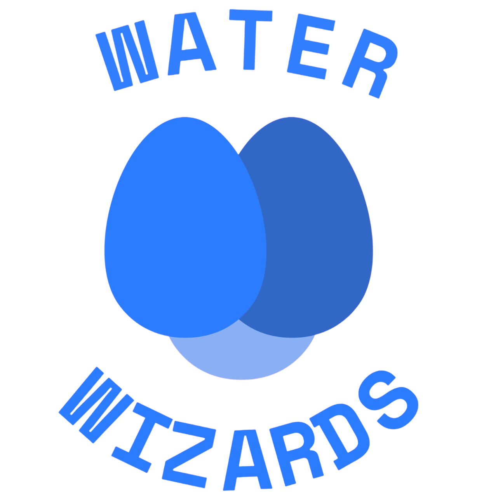

# Hi!ckathon 5th Edition 2024: AI & Sustainability 🌲

## Event

The present code is developed during a contest called 'HI!CKATHON' organized at the request of HEC Paris and Institut Polytechnique de Paris, in the context of the Hi! PARIS Center.
https://github.com/hi-paris/Hickathon5

## Project: Business and Scientific document

## I. Project Overview

The issue at hand is to predict the groundwater levels in summer in regions in France. Indeed, due to climate change and increasingly hot summers, it is critical that communities are able to predict the quantities of water available, in order to guarantee access to a reliable and safe water supply, which is essential for agriculture, daily life and the local environment.

Using state-of-the-art machine learning solutions, our team of top-notch engineers built a model to accurately predict groundwater levels in summer, empowering municipalities and companies with precise knowledge they can leverage to balance their needs and uses of water responsibly.
### Meet the team :handshake:
| First name | Last name   | Year of studies & Profile | School  | Skills                                                                          | Roles/Tasks                                                            |
|------------|-------------|---------------------------|---------|---------------------------------------------------------------------------------| ---------------------------------------------------------------------- |
| Yann       | Ntsama          | M2                        | Telecom | Data science and modelling                                                                 | Video making and data exploration                                      |
| Giovanni   | Benedetti da Rosa       | M2                        | Telecom | Expertise in business modeling, business skills                                 | Git lord, preprocessing, Model Optimization                       |
| Yassine    | ?           | M2                        | ENSTA   | Data science and business,  Capability to work with both teams to join any task | Coordinator, Linking business and technical units ; Data preprocessing |
| Cristian  | Chávez           | M2                        | Telecom | Data Science and Computer Science expert                                                  | Data preprocessing supervisor, model optimization, feature engineering |
| Olivier    | de Boissieu | Y1                        | ENSAE   | Project management, communication                                                       | Preprocessing, communication (branding, business model and presentation)                                         |

